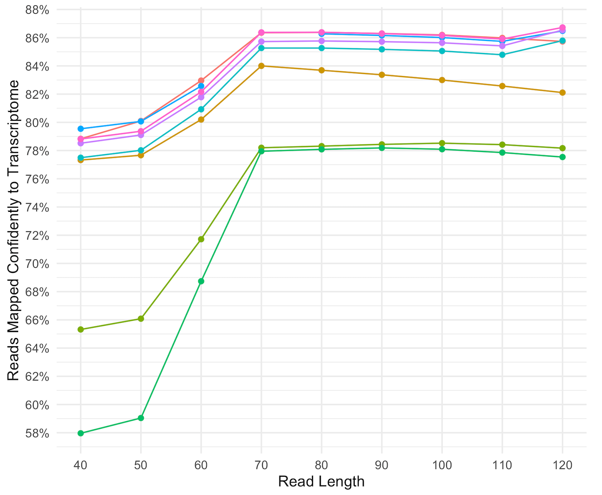

# ST-analysis
General notes and resources on how to analyze Spatial Transcriptomics data

## Resources of interest
- http://spatialomics.net/

## Software to handle ST data

### R
- [Seurat v3.2](https://satijalab.org/seurat/v3.2/spatial_vignette.html) developed by Rahul Satija lab.
- [STUtility](https://github.com/jbergenstrahle/STUtility) developed by Joseph Bergenstråhle and Ludvig Larsson from  Joakim Lundeberg lab.
- [Giotto](http://spatialgiotto.rc.fas.harvard.edu/) developed by Ruben Dries from Guo-Cheng Yuan lab. Tutorials can be found [here](http://spatialgiotto.rc.fas.harvard.edu/documentation2.html)
- [SPATA2](https://themilolab.github.io/SPATA2/) A Toolbox for Spatial Gene Expression Analysis from the Milo lab. Contains great tools to visualize gene expression, draw spatial trajectories, manual segmention of clusters, autoencoder denosisng (like MAGIC), spatial pseudotime, trajectory modelling and CNV analysis

### Python
- [scanpy](https://scanpy-tutorials.readthedocs.io/en/latest/spatial/basic-analysis.html) developed by Giovanni Palla from Fabian Theis Lab.
- [Tangram](https://github.com/broadinstitute/Tangram) Tangram is a Python package, written in PyTorch, for mapping single-cell (or single-nucleus) gene expression data onto spatial gene expression data. The single-cell dataset and the spatial dataset should be collected from the same anatomical region/tissue type, ideally from a biological replicate, and need to share a set of genes (usually from twenty to a thousand). Tangram aligns the single-cell data in space by fitting gene expression on those genes. We mostly work with transcriptomic data (typically 10Xv3 for scRNAseq data; MERFISH or Visium as spatial data).
- [stLearn](https://www.biorxiv.org/content/10.1101/2020.05.31.125658v1.full) with the corresponding [vignette](https://stlearn.readthedocs.io/en/latest/). Developed by Duy Pham from Quan Nguyen lab. We have developed an analysis method that exploits all three data types: Spatial distance, tissue Morphology, and gene Expression measurements (SME) from ST data. This combinatorial approach allows us to more accurately model underlying tissue biology, and allows researchers to address key questions in three major research areas: cell type identification, cell trajectory reconstruction, and the study of cell-cell interactions within an undissociated tissue sample.
- [squidpy](https://squidpy.readthedocs.io/en/latest/) tool for the analysis and visualization of spatial molecular data. It builds on top of scanpy and anndata, from which it inherits modularity and scalability. It provides analysis tools that leverages the spatial coordinates of the data, as well as tissue images if available.
- [xfuse](https://github.com/ludvb/xfuse) XFuse can infer high-resolution, full-transcriptome spatial gene expression from histological image data and be used to characterize transcriptional heterogeneity in detailed anatomical structures.


### Tools of interest
#### Spatially variable genes
Very nice summary of the tools [here](http://spatialgiotto.rc.fas.harvard.edu/giotto_spatial_genes.html) from where the tools summary is obtained.
- [SpatialDE](https://www.nature.com/articles/nmeth.4636) developed by Valentine Svensson. A statistical test to identify genes with spatial patterns of expression variation from multiplexed imaging or spatial RNA-sequencing data. The method uses Gaussian process regression to decompose expression variability into a spatial covariance term and nonspatial variance term. The spatial covariance term assumes a linear trend and periodic pattern of gene expression variation. Multiple different spatial covariance functions are tested including: (1) null model, (2) general Gaussian covariance (squared exponential), (3) linear covariance, and (4) periodic covariance functions. A suitable model is selected using Bayes information criterion. Implementation in Python.
- [Trendsceek] The method employs previous functions within R called spatstat. In basic, it computes four statistics mark-seggregation summary statistics, including the Stoyan's mark-correlation function, mean-mark function, variance-mark function and mark-variogram of marked point process. Mark seggregation computes the probability of finding two marks given the separation of two points. Considering the distribution of all pairs at a particular radius, a mark segregation is said to be present if this distribution is dependent on r, such that it deviates from what would be expected if the marks would be randomly distributed over the spatial locations of the points. For statistical testing, a null distribution of summary statistics is computed for every radius r, after permuting expression labels. The maximum deviation (from expected value) observed among n randomly distributed patterns is compared with the observed deviation (from expected value). A p-value is calculated via the rank.
- [SPARK](https://www.nature.com/articles/s41592-019-0701-7) SPARK is a method perceived as an extension of SpatialDE. SPARK models count data directly and employs properly calibrated p-values. Well-calibrated p-values allows this method to find more spatially variable genes at a given FDR cut-off. This is sometimes an improvement over SpatialDE which may produce overly conservative p-values. SPARK models expression levels across spatial locations using generalized linear spatial model (GLSM). It allows modeling the distribution of expression values through an overdispersed Poisson distribution (for count data) or Gaussian distribution (for normalized data). Notably, to make sure that the algorithm can discover various spatial patterns, SPARK employs ten different spatial kernels, including five periodic kernels with different periodicity parameters and five Gaussian kernels with different smoothness parameters. [R Tutorial/Vignette](https://xzhoulab.github.io/SPARK/)
- [BinSpect] This method uses a graph based approach to compute the probability of encountering two physically neighboring cells being both expressed. It first computes a KNN neighborhood graph for a given k (defined by user) based on cells' physical locations. For each gene, it binarizes gene expression value across all the cells (1 for expressed, 0 for nonexpressed). An edge in the KNN graph connecting two cells is classified as 1-0, 1-1, 0-1, or 0-0 based on gene expression label. A contigency table tallying all the 1-1's, 1-0's, 0-1's, and 0-0's edges for the entire KNN network is created. A P-value is reported based on the hypergeometric distribution test. 
- [SilhouetteRank] This method stands for silhouette coefficient on binarized spatial gene expression profiles. As the name suggests, gene expression is first binarized to 1's (expressed) and 1's (nonexpressed). It next calculates silhouette coefficient of the 1-marked cells on a locally weighted spatial distance matrix. The distance function is 1 -similarity, where the similarity function is a rank-based, exponentially-transformed score emphasizing more the closely located cells and penalizes far away cells' distance. For statistical testing, N randomly permuted patterns are generated by shuffling the cell locations while keeping the distribution of 1's and 0's the same as real data. The extreme right-tail of distribution of random patterns' silhouette scores is modeled using the GPD distribution. 

#### TF/Regulons
- [MISTy](https://saezlab.github.io/misty/) developed by Jovan Tanevski from Saez-Rodriguez lab.  Multiview Intercellular SpaTial modeling framework (**MISTy**) is an explainable machine learning framework for knowledge extraction and analysis of single-cell, highly multiplexed, spatially resolved data. MISTy facilitates an in-depth understanding of marker interactions by profiling the intra- and intercellular relationships.
- [PROGENy](https://www.bioconductor.org/packages/release/bioc/vignettes/progeny/inst/doc/ProgenySingleCell.html). Developed by Alberto Valdeolivas from Saez-Rodriguez lab. Estimates the activity of 14 relevant signaling pathways based on consensus gene signatures obtained from perturbation experiments.
- [Omnipath](https://saezlab.github.io/OmnipathR/articles/OmnipathMainVignette.html) Saez-Rodriguez lab. A comprehensive collection of molecular biology prior knowledge from 103 databases, with focus on literature curated human and rodent signaling pathways. Software suite for functional omics data analysis and mechanistic modeling of intra- and inter-cellular signaling.
- [DOROTHEA](https://bioconductor.org/packages/release/data/experiment/html/dorothea.html) Saez-Rodriguez lab.This package contains human and mouse TF regulons. The human regulons were curated and collected from different types of evidence such as literature curated resources, ChIP-seq peaks, TF binding site motifs and interactions inferred directly from gene expression. The mouse regulons were constructed by mapping the human gene symbols to their orthologs in mice. Those regulons can be coupled with any statistical method that aims to analyse gene sets to infer TF activity from gene expression data. Preferably the statistical method viper is used. Now this is incorporated in [squidpy](https://squidpy.readthedocs.io/en/latest/).

#### Segmentation
- [Histolab](https://github.com/histolab/histolab) The aim of this project is to provide a tool for Whole Slide Images (WSI) processing in a reproducible environment to support clinical and scientific research. Histolab is designed to handle WSIs, automatically detect the tissue, and retrieve informative tiles, and it can thus be integrated in a deep learning pipeline.
- [Spaniel](https://www.biorxiv.org/content/10.1101/619197v1) developed by Rachel Queen
- [starmapVR](https://github.com/holab-hku/starmapVR) developed by Andrian Yang to visualize single-cell and spatial omic data in 3D
- [Baysor](https://www.biorxiv.org/content/10.1101/2020.10.05.326777v1.full) developed by Viktor Petukhov from Kharchenko lab. Bayesian Segmentation of Spatial Transcriptomics Data (**-ISH + In situ sequencing**) (Baysor), which optimizes segmentation considering the likelihood of transcriptional composition, size and shape of the cell. The Bayesian approach can take into account nuclear or cytoplasm staining, however can also perform segmentation based on the detected transcripts alone.
- [MCMICRO](https://github.com/labsyspharm/mcmicro) mcmicro is the end-to-end processing pipeline for multiplexed whole tissue imaging and tissue microarrays. It comprises stitching and registration, segmentation, and single-cell feature extraction. [Tweetorial](https://twitter.com/DenisSchapiro/status/1372220682545754114)
- [Spot-based Spatial cell-type Analysis by Multidimensional mRNA density estimation - SSAM](https://github.com/HiDiHlabs/ssam) we present a novel method called Spot-based Spatial cell-type Analysis by Multidimensional mRNA density estimation (SSAM), a robust cell segmentation-free computational framework for identifying cell-types and tissue domains in 2D and 3D. SSAM is applicable to a variety of in situ transcriptomics techniques and capable of integrating prior knowledge of cell types.

#### Spatio-Temporal analsysi
- [MEFISTO](https://biofam.github.io/MOFA2/MEFISTO.html) developed by Britta Velten, it is a flexible and versatile toolbox for modelling high-dimensional data when spatial or temporal dependencies between the samples are known. MEFISTO maintains the established benefits of factor analysis for multi-modal data, but enables performing spatio-temporally informed dimensionality reduction, interpolation and separation of smooth from non-smooth patterns of variation. Moreover, MEFISTO can integrate multiple related datasets by simultaneously identifying and aligning the underlying patterns of variation in a data-driven manner.
- [VeloViz](https://www.biorxiv.org/content/10.1101/2021.01.28.425293v1) developed by Lyla Atta. We developed VeloViz to create RNA-velocity-informed 2D embeddings. We show that by taking into consideration the predicted future transcriptional states from RNA velocity analysis, VeloViz can help ensure a more reliable representation of underlying cellular trajectories.

#### OMICS integration
- [ScoMAP](https://rawcdn.githack.com/aertslab/ScoMAP/f6cd6724682d4b6c2a8f44b2a18824a56cff2146/vignettes/Vignette.html). Spatial integration of scRNA-seq and scATAC-seq using ScoMAP is an R package to spatially integrate single-cell omics data into virtual cells. These virtual cells may be organized in a template that resembles the tissue (e.g. such as the Drosophila’s eye-antennal disc; see Bravo González-Blas et al., 2019a), or into an abstract space (e.g. when cell types are not spatially located). ScoMAP also includes functionalities to derive enhancer-to-gene relationships from the virtual template when mapping both single-cell transcriptomic and epigenomic data into the virtual cells.

#### Deconvolution tools
- [SPOTlight](https://github.com/MarcElosua/SPOTlight) developed by Marc Elosua from Holger Hey lab.
- [Stereoscope](https://github.com/almaan/stereoscope) developed by Alma Andersson from Lundeberg Lab.
- [cell2location](https://github.com/BayraktarLab/cell2location) developed by Vitalii Kleshchevnikov from Bayraktar lab. 
- [Robust Cell Type Decomposition](https://github.com/dmcable/RCTD) developed by Dylan M. Cable from Irizarry lab.

#### Cell-Cell interactions
- [CellPhoneDB](https://github.com/Teichlab/cellphonedb) developed by Roser Vento. CellPhoneDB is a publicly available repository of curated receptors, ligands and their interactions. Subunit architecture is included for both ligands and receptors, representing heteromeric complexes accurately. This is crucial, as cell-cell communication relies on multi-subunit protein complexes that go beyond the binary representation used in most databases and studies.
- [scTalk](https://github.com/VCCRI/scTalk/) developed by Farbehi. N scTalk is an R package for intercellular communication (ligand-receptor) analysis from scRNA-seq data and implements the method described in [Farbehi et al](https://elifesciences.org/articles/43882).
- [NATMI](https://www.nature.com/articles/s41467-020-18873-z) developed by Rui Hou. NATMI uses connectomeDB2020 (a database of 2293 manually curated ligand-receptor pairs with literature support) to predict and visualise cell-to-cell communication networks from single-cell (or bulk) expression data. GitHub repo [here](https://github.com/forrest-lab/NATMI/).
- Twitter thread from [CrazyHotTommy](https://twitter.com/tangming2005/status/1366780396306911239) with multiple tools.
- [CellChat](http://www.cellchat.org/) CellChat Explorer contains two major components: (a) Ligand-Receptor Interaction Explorer that allows easy exploration of our ligand-receptor interaction database, and (b) Cell- Cell Communication Atlas Explorer that allows easy exploration of the cell-cell communications for any given scRNA-seq dataset that has been processed by our [R package](https://github.com/sqjin/CellChat). Published paper [here](https://www.nature.com/articles/s41467-021-21246-9) claims "_Currently existing tools, such as SingleCellSignalR and iTALK, typically use only one ligand/one receptor gene pairs, largely neglecting the effect of multiple receptors._"

#### Digital pathology
- [Deeplearning-digital-pathology](https://github.com/zhaoxuanma/Deeplearning-digital-pathology) This repository contains utilities for virtual slides and images classification and semantic segmentation with Keras and Caffe and an extension class of ImageDataGenerator of Keras to generate batches of images with data augmentation for segmentation. Demo code is provided for reference.
- [VAMPIRE](https://www.nature.com/articles/s41596-020-00432-x) Cell morphology encodes essential information on many underlying biological processes. It is commonly used by clinicians and researchers in the study, diagnosis, prognosis, and treatment of human diseases. Quantification of cell morphology has seen tremendous advances in recent years. However, effectively defining morphological shapes and evaluating the extent of morphological heterogeneity within cell populations remain challenging. Here we present a protocol and software for the analysis of cell and nuclear morphology from fluorescence or bright-field images using the VAMPIRE algorithm (https://github.com/kukionfr/VAMPIRE_open). [tweetorial](https://twitter.com/JudeM_Phillip/status/1348669520194359307)
##### Lymphocyte detection
- [Automatic Lymphocyte Detection on Gastric Cancer IHC Images Using Deep Learning](https://ieeexplore.ieee.org/document/8104187): Tumor-infiltrating lymphocytes (TILs) have received considerable attention in recent years, as evidence suggests they are related to cancer prognosis. Distribution and localization of these and other types of immune cells are of special interest for pathologists, and frequently involve manual examination on Immunohistochemistry (IHC) Images. We present a model based on Deep Convolutional Neural Networks for Automatic lymphocyte detection on IHC images of gastric cancer. The dataset created as part of this work is publicly available for future research.
- [Convolutional Neural Networks for Lymphocyte detection in Immunohistochemically Stained Whole-Slide Images](https://openreview.net/forum?id=rk0xLisiM): 
- [https://pubmed.ncbi.nlm.nih.gov/31476576/](https://pubmed.ncbi.nlm.nih.gov/31476576/):
## General Comments
Things to keep in mind when pre-processing the data

- Optimal Read length for confident mapping Spaceranger v1.1.0

- Make sure the slice images form the Visium slide contain all the dotted borders and corners. These are necessary to automatically align the image and the spots.

## QC
[STUtility](https://ludvigla.github.io/STUtility_web_site/Quality_Control.html) shows a great workflow on how to carry out QC analysis on ST data!
- Remove all spots not overlapping tissue. When there are tissueless regions within the capture areas, especially within the tissue there might be some lateral diffusion and reads may map to those spots. It is important to remove those spots manually using spaceranger prior to alignment!
- Before processing the data check that there are no empty spots overlaying the tissue.
- Explore number of reads and genes on the slice
- Explore mitochondrial content on the slice
```
mt.genes <- grep(pattern = "^MT-")
```
- Explore ribosomal content on the slice
```
ribo.genes <- grep(pattern = "^RPL|^RPS")
```
- No hard thresholds are set to remove spots based on the prior parameters. It is important to understand the biology of the tissue under study in order to process the data accordingly. 
